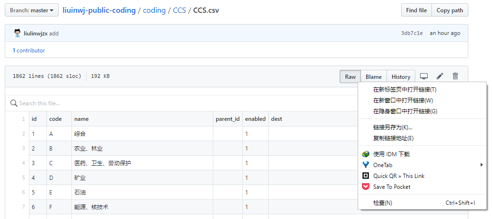

编码工程时，经常因为缺少基础数据，比如最新的县级行政区划及代码、中国各民族编码等而四处搜罗。而临时搜集的数据往往有不够完整、顺序错乱的瑕疵，甚至出现名称、编码错误的问题。所以，我把搜集的一些基础数据共亨出来，大家可以下载，也欢迎大家把自己收集、整理的基础数据共亨出来。

本项目会提供了 CSV、JSON、SQLITE 三种格式，可以直接下载使用。

CSV 文件可以用 Excel 打开后，SQLITE(.db) 文件可以用 Navicat、SQLITE Expert 或 SQLITE Studio 等打开。可以直接使用，也可以编辑、筛选后再使用。

1. 可以通过[目录](https://github.com/liulinwjzx/liuinwj-public-coding/blob/master/list.md)下载。
2. 也可以在 `coding` 文件夹里下载。
    1. 对于二进制文件（如 `.db`），可以点击 download 下载。

    2. 对于文本文件（如 `.csv` 和 `.json`），可以点击 Raw 后下载，也可以右击 Raw 后用下载工具或者把地址复制进下载工具下载。

