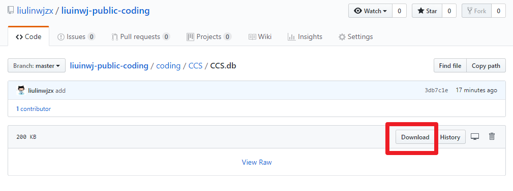
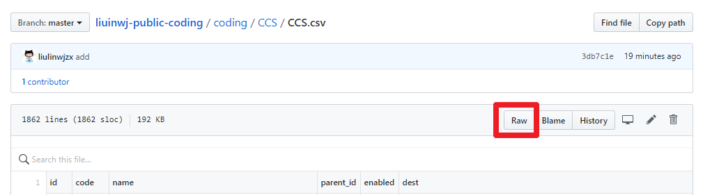

- [Chinese](readme.md)
- [English](readme_en.md)

When coding projects, we often search for basic data(Such as code of nations, currencies, etc.) because we lack them. However, the data collected temporarily is often not complete enough, disordered and even the names and codings are wrong, you need to reorganize and correct it yourself. Therefore, I have push the baisc data collected and collated by myself. You can download them, and welcome to share the basic data collected and organized.

This project provides three formats: CSV, JSON, and SQLite. It can be downloaded and used directly. It can also be edited, filtered, and used.

CSV files can be opened in Excel, and SQLite (.db) files can be opened with Navicat, SQLite Expert, or SQLiteStudio.

[**Click to browse Table of Content**](coding)

For binary files (such as `.db`) or larger text files, you can click download to download.

For smaller text files (such as `.csv` and `.json`), you can click Raw to download, or you can right-click Raw and download directly by tools or copy the address into the download tools.

